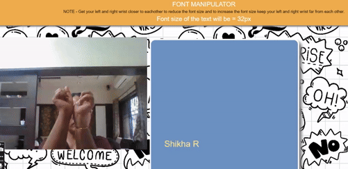

# Font Manipulator using POSENET

# Project Description
This project uses the pretrained POSENET model to dynamically change the font size on a webpage based on the distance between a user's wrists. The POSENET model is used for real-time pose estimation to track the wrist positions, and as the distance between the wrists increases or decreases, the font size is adjusted accordingly.

## Demo

## Features
- Real-time wrist tracking using the pretrained POSENET model.
- Dynamic font size adjustment based on the distance between the two wrists.
- Fun and interactive way to control font sizes with hand movements.

## Technologies Used
- **Machine Learning**: POSENET (for wrist detection)
- **Frontend**: HTML, CSS, JavaScript

## Usage
- Allow access to your webcam when prompted.
- As you move your hands closer or farther apart, the font size on the screen will increase or decrease based on the distance between your wrists.

## POSENET Model
The pretrained POSENET model is used for real-time wrist detection. The distance between the wrists is calculated, and based on the change in that distance, the font size on the webpage adjusts dynamically. 
